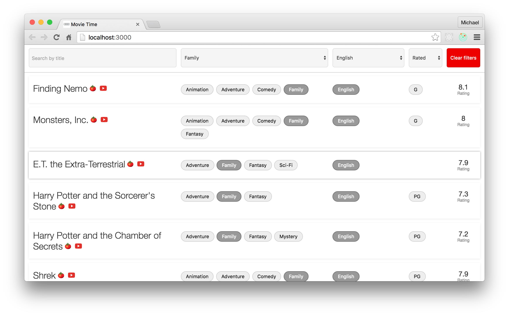

# Movie Time

Movie Time is a response to a programming Challenge.

Please use a recent node version. This has been tested with node v4.3 and v6.2.

## Quick start

- git clone
- npm install
- npm start (runs tests, build and starts a local server)

## Some thoughts

I went a bit overboard and spent more time on this than I should have. But I was having fun.

The tests are incomplete but should show an ability to test React components and the redux store reducers.

### New things

- I hadn't used CSS Modules before. This is a really interesting tech idea. Combined with a css preprocessor for mixins and variables this feels like a great way to make modular components. It did present a few challenges with unit testing but a quick google sorted that out. (see lines 2 & 5 of test/.setup.js)

- No task runner. I find it amazing how much you can do with just npm scripts. Having css be handled as part of the JS build made this easier too.

## Further Development

If I were to put more time into this I would be looking at the following areas:

- Sort the dropdown lists alphabetically.
- Filter by multiple genres / languages
- Order results by rating / title
- Transition animations when filtering the results
- When changing filter by clicking on a result button, highlight the result so it is easier to find after transitions.
